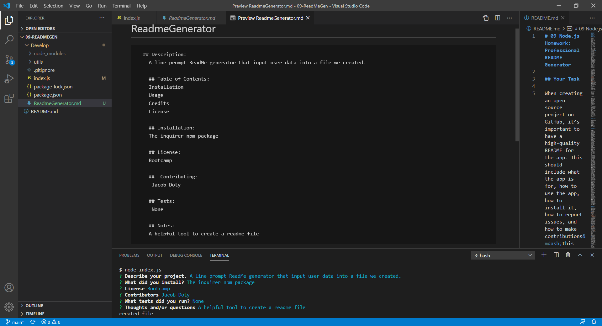

# ReadmeGenerator

## Description 
A readme file generator that takes user input from line prompts and displays it in a format using template literal.

## Installation

Download the folder from github and use the command "node index.js" from the terminal in the directory of Develop.


## Usage 

Using the command line, create a file with input from prompts.

```md

```

## Credits

The inquirer npm package.

